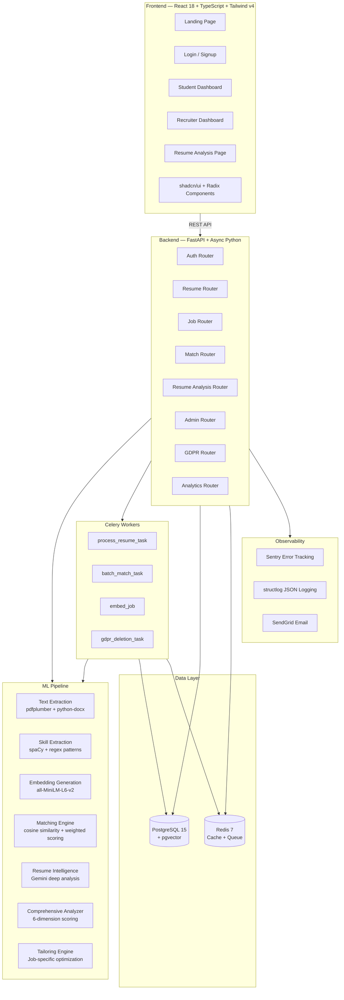
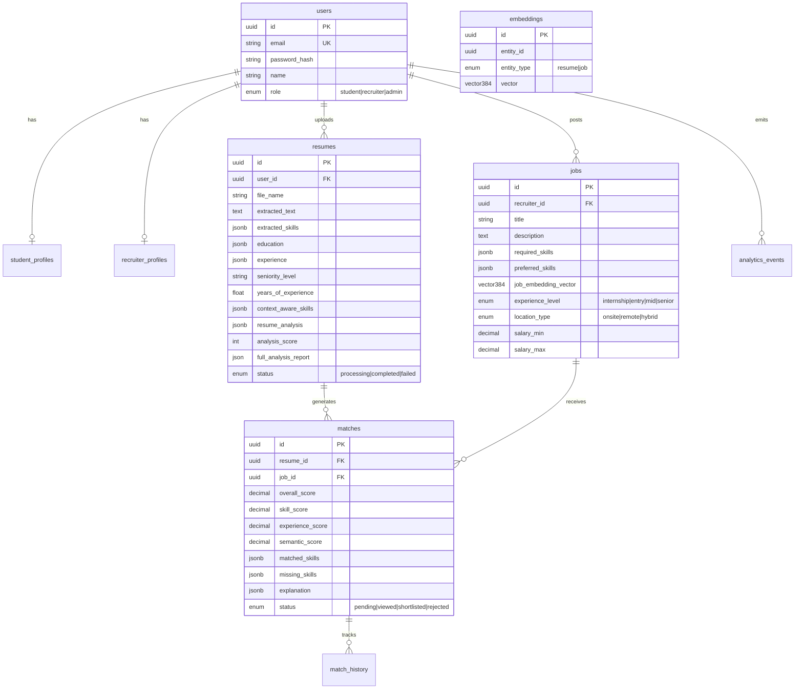

# AI Resume Matchmaking System — Extensive Project Summary

> **Production-grade, full-stack AI/ML platform** for intelligent resume-to-job matching using semantic embeddings, NLP skill extraction, Gemini-powered analysis, and multi-factor ranking algorithms.

---

## 1. High-Level Architecture



---

## 2. Technology Stack

### Frontend
| Technology | Version | Purpose |
|---|---|---|
| React | 18.3.1 | UI framework |
| TypeScript | latest | Type safety |
| Vite | 6.3.5 | Build tool & dev server |
| Tailwind CSS | 4.1.12 | Utility-first styling |
| shadcn/ui + Radix | latest | Component library (30+ primitives) |
| React Router | 7.13.0 | Client-side routing |
| Recharts | 2.15.2 | Data visualization |
| Motion (Framer) | 12.23.24 | Animations |
| Lucide React | 0.487.0 | Icon library |
| Vitest | 1.6.0 | Unit testing |

### Backend
| Technology | Version | Purpose |
|---|---|---|
| FastAPI | 0.104.1 | Async REST API framework |
| SQLAlchemy | 2.0.23 (async) | ORM + async sessions |
| Alembic | 1.12.1 | Database migrations |
| Pydantic v2 | 2.5.0 | Schema validation with camelCase aliases |
| Celery | 5.3.6 | Background task queue |
| sentence-transformers | 2.2.2 | Real semantic embeddings |
| Google Generative AI | 0.8.3 | Gemini-powered analysis |
| spaCy | 3.7.2 | NLP processing |
| pdfplumber | 0.10.3 | PDF text extraction |
| python-docx | 1.1.0 | DOCX text extraction |
| pgvector | 0.2.3 | Vector similarity search |
| structlog | 23.2.0 | Structured JSON logging |
| Sentry SDK | 1.39.1 | Error monitoring |
| SendGrid | 6.11.0 | Transactional email |
| passlib + bcrypt | 1.7.4 | Password hashing |
| python-jose | 3.3.0 | JWT tokens |
| tenacity | 8.2.3 | Retry logic for Gemini |

### Infrastructure
| Technology | Purpose |
|---|---|
| Docker Compose | 6-service orchestration |
| PostgreSQL 15 + pgvector | Primary database with vector search |
| Redis 7 Alpine | Celery broker + Gemini cache |
| Nginx | Frontend reverse proxy |

---

## 3. Database Schema (8 Tables, 4 Alembic Migrations)



### Alembic Migration History
1. **0001** — Initial schema (users, profiles, resumes, jobs, matches, embeddings, analytics)
2. **0002** — pgvector IVFFlat indexes for cosine similarity search
3. **0003** — Resume intelligence fields (seniority, career trajectory, domain expertise, impact metrics, context-aware skills)
4. **0004** — Comprehensive analysis fields (score breakdown, ATS parse rate, spelling/grammar issues, design feedback, template suggestions)

---

## 4. Backend API — 8 Route Groups, 30+ Endpoints

### Authentication (`/api/v1/auth`)
| Method | Endpoint | Description |
|---|---|---|
| POST | `/login` | JWT login (rate limited 5/min) |
| POST | `/signup` | Account creation + welcome email |
| POST | `/logout` | Session invalidation |
| GET | `/me` | Current user info from JWT |

### Resumes (`/api/v1/resumes`)
| Method | Endpoint | Description |
|---|---|---|
| POST | `/upload` | PDF/DOCX upload → Celery processing |
| GET | `/user/{user_id}` | List user's resumes |
| GET | `/{resume_id}` | Get single resume |
| DELETE | `/{resume_id}` | Delete resume + file |

### Resume Analysis (`/api/v1/resume-analysis`)
| Method | Endpoint | Description |
|---|---|---|
| POST | `/{id}/analyze` | Full 6-dimension analysis (cached) |
| GET | `/{id}/report` | Retrieve stored analysis report |
| POST | `/{id}/tailor` | Job-specific tailoring suggestions |

### Jobs (`/api/v1/jobs`)
| Method | Endpoint | Description |
|---|---|---|
| POST | `/` | Create job + auto-embed via Celery |
| GET | `/` | List all active jobs |
| GET | `/recruiter/{id}` | Recruiter's job postings |
| GET | `/{job_id}` | Single job details |
| PUT | `/{job_id}` | Update job posting |
| DELETE | `/{job_id}` | Delete job |

### Matches (`/api/v1/matches`)
| Method | Endpoint | Description |
|---|---|---|
| POST | `/resume/{id}` | Match resume → all active jobs |
| POST | `/job/{id}` | Match job → all candidates |
| GET | `/student/{id}` | Student's matches |
| GET | `/recruiter/{id}` | Recruiter's matches |
| GET | `/job/{id}` | Job's candidate matches |
| PATCH | `/{id}/status` | Update match status |

### GDPR Compliance (`/api/v1/gdpr`)
| Method | Endpoint | Description |
|---|---|---|
| GET | `/export` | Right of Access (Article 15) |
| POST | `/delete` | Right to Erasure (Article 17) |
| GET | `/consent` | Query consent status |
| POST | `/consent` | Grant/revoke consent |

### Admin & Analytics
- Admin panel endpoints for user management and system statistics
- Analytics event tracking and dashboard metrics

---

## 5. ML Pipeline — Complete Processing Chain

### 5.1 Resume Processing (Celery Task: `process_resume_task`)

```
Upload → Text Extraction → Skill Extraction → Intelligence Analysis → Embedding → DB Update
```

1. **Text Extraction** — `pdfplumber` for PDF, `python-docx` for DOCX files
2. **Skill Extraction** — Pattern matching against 200+ technical skills with categorization (technical/soft/domain) and confidence scoring
3. **Resume Intelligence** (Gemini-powered with rule-based fallback):
   - Seniority estimation (junior → principal)
   - Years of experience (computed from timeline)
   - Career trajectory detection
   - Impact metrics extraction (verbatim achievements with numbers)
   - Context-aware skills (skill + how it was used)
   - Hidden skill inference
   - Skill depth classification (expert/proficient/familiar)
4. **Embedding Generation** — `all-MiniLM-L6-v2` sentence-transformers (384-dimensional normalized vectors)

### 5.2 Matching Engine (Weighted Multi-Factor Scoring)

```
Overall Score = (0.5 × Semantic) + (0.3 × Skill) + (0.2 × Experience)
```

- **Semantic Score (50%)** — Cosine similarity between resume and job embedding vectors using real sentence-transformers
- **Skill Score (30%)** — Weighted Jaccard: 60% required skills, 30% preferred, 10% bonus for additional skills. Includes context-aware skill scoring (production/scale context = higher bonus)
- **Experience Score (20%)** — Level-based alignment (internship → senior)
- **Explanation Generation** — Human-readable match summaries with strengths, gaps, and recommendations

### 5.3 Comprehensive Resume Analyzer (6 Dimensions)

| Category | Weight | What's Analyzed |
|---|---|---|
| **Content** | 40% | ATS parse rate, quantified achievements, repetition detection, spelling/grammar (Gemini) |
| **Sections** | 20% | Essential sections present/missing (experience, education, skills, summary, contact) |
| **ATS Essentials** | 15% | File format compliance, contact info completeness, file size |
| **Design** | 10% | Layout detection, bullet usage, section headers, page count |
| **Skills** | 10% | Skill density (count of distinct technical skills) |
| **Tailoring** | 5% | Keyword alignment with job description (when provided) |

### 5.4 Resume Tailoring Engine (Gemini-Powered)
- Missing keyword identification from job descriptions
- Bullet point rewrite suggestions
- Skills to highlight more prominently
- Tailored professional summary generation
- Gap analysis with top 3 action items

---

## 6. Frontend — Pages & Components

### Pages (7 routes)
| Route | Component | Description |
|---|---|---|
| `/` | `LandingPage` | Marketing page with feature showcase |
| `/login` | `LoginPage` | Dual-role login (student/recruiter) |
| `/signup` | `SignupPage` | Registration with role-specific fields |
| `/student` | `StudentDashboard` | Resume upload, matches, analytics |
| `/student/resume/:id/analysis` | `ResumeAnalysisPage` | Full analysis dashboard (lazy loaded) |
| `/recruiter` | `RecruiterDashboard` | Job posting, candidate matching |
| `*` | `NotFoundPage` | 404 handler |

### Analysis UI Components (11 specialized components)
| Component | Purpose |
|---|---|
| `ScoreGauge` | Animated circular score visualization |
| `CategoryScoreBar` | Horizontal bar for category breakdowns |
| `SectionCard` | Present/missing section checklist |
| `IssueChip` | Severity-tagged issue badges |
| `KeywordCloud` | Visual keyword frequency display |
| `KeywordGapRing` | Donut chart for keyword coverage |
| `GapAnalysisBar` | Progress bars for gap metrics |
| `BulletRewriteCard` | Before/after bullet point suggestions |
| `TailoredSummaryCard` | AI-generated professional summary |
| `TailoringResults` | Full tailoring report panel |
| `TemplateShowcase` | Resume template recommendations |

### Core UI Components
- `MatchScoreCard` — Match result cards with score breakdown
- `SkillBadgeList` — Categorized skill tag display
- Full shadcn/ui component library (30+ Radix primitives)

### State Management
- `AuthContext` — Global auth state with JWT token management
- `useData` hook — Centralized data fetching for resumes, jobs, matches
- `apiService` — Type-safe API client with automatic 401 handling

---

## 7. Production Infrastructure

### Docker Compose — 6 Services
| Service | Image | Purpose |
|---|---|---|
| `backend` | Custom FastAPI | API server (port 8000) |
| `celery-worker` | Same image | Background processing (3 queues) |
| `celery-beat` | Same image | Scheduled tasks |
| `frontend` | Nginx | Static SPA hosting (port 80) |
| `db` | pgvector/pgvector:pg15 | PostgreSQL + vector extensions |
| `redis` | redis:7-alpine | Queue broker + cache |

### Security Features
- JWT authentication with bcrypt password hashing
- Security headers middleware (HSTS, X-Frame-Options, CSP, XSS protection)
- Rate limiting on auth endpoints (5 login/min, 3 signup/min)
- Production startup validation (rejects weak secrets, wildcard CORS)
- Sentry PII filtering (strips Authorization headers, password fields)
- GDPR-compliant data export and deletion

### Observability
- **Structured Logging** — structlog with JSON output in production, colored console in dev
- **Error Monitoring** — Sentry with FastAPI + SQLAlchemy integrations
- **Health Checks** — `/health` (liveness) + `/ready` (readiness with DB check)
- **Request Logging** — Every HTTP request logged with method, path, status, duration

### Email Notifications (SendGrid)
- Welcome emails on signup
- Match notifications for students
- Candidate match alerts for recruiters
- All fire-and-forget with Sentry error capture

---

## 8. AI/ML Integration — Google Gemini

The system uses **Gemini 1.5 Flash** for three AI-powered features:

1. **Resume Intelligence** — Deep understanding extraction (seniority, trajectory, impact metrics, context-aware skills)
2. **Spelling & Grammar Analysis** — AI-powered proofreading with conservative error flagging
3. **Content Quality Assessment** — Professional tone scoring, action verb quality, specificity analysis
4. **Resume Tailoring** — Job-specific optimization with keyword gaps and bullet rewrites

### Gemini Client Architecture
- Async execution via `run_in_executor` (SDK is synchronous)
- Redis caching with SHA-256 prompt hashing (24-hour TTL)
- Exponential backoff retry (3 attempts via tenacity)
- 30-second timeout per request
- **Graceful degradation** — All features fall back to rule-based logic when Gemini is unavailable

---

## 9. Model Management — Sentence-Transformers

- **Model**: `all-MiniLM-L6-v2` (384 dimensions, ~90MB)
- **Thread-safe singleton** with double-checked locking
- **Warm-up on startup** to prevent cold-start latency
- **Disk caching** at `EMBEDDING_CACHE_DIR` to avoid re-downloads
- Functions: `encode_text()`, `encode_batch()`, `cosine_similarity()`
- Batch encoding with configurable `EMBEDDING_BATCH_SIZE` (default 32)

---

## 10. Testing Infrastructure

- **Frontend**: Vitest + React Testing Library + MSW (mock service worker)
- **Backend**: pytest + pytest-asyncio + aiosqlite (in-memory testing)
- Multiple debug scripts: `debug_auth_401.py`, `debug_upload.py`, `debug_validation.py`, `test_startup.py`
- Syntax checking scripts: `_check_syntax.py`

---

## 11. Key Bugs Fixed (from Conversation History)

1. **Pydantic camelCase/snake_case mismatch** — Created `CamelModel` base class with `alias_generator` and `populate_by_name=True` for seamless frontend ↔ backend communication
2. **TypeScript syntax errors** in UI components (IssueChip, analysis components)
3. **Resume upload pipeline failures** — Fixed text extraction flow and status tracking
4. **401 auth debugging** — JWT token validation and role verification fixes

---

## 12. File Count Summary

| Area | Files | Lines of Code (approx) |
|---|---|---|
| Backend API routes | 9 | ~2,500 |
| Backend services | 7 | ~2,800 |
| Backend schemas | 10 | ~1,200 |
| ML pipeline | 7 | ~3,500 |
| Celery workers | 4 | ~1,400 |
| Core (config, auth, email) | 9 | ~2,200 |
| Database models + migrations | 6 | ~1,600 |
| Frontend pages | 6 | ~4,500 |
| Frontend components | 15+ | ~2,500 |
| Frontend services/hooks | 4 | ~2,500 |
| Frontend types | 1 | ~400 |
| Infrastructure (Docker, Nginx) | 5 | ~400 |
| **Total** | **~85+ source files** | **~25,000+ LOC** |
